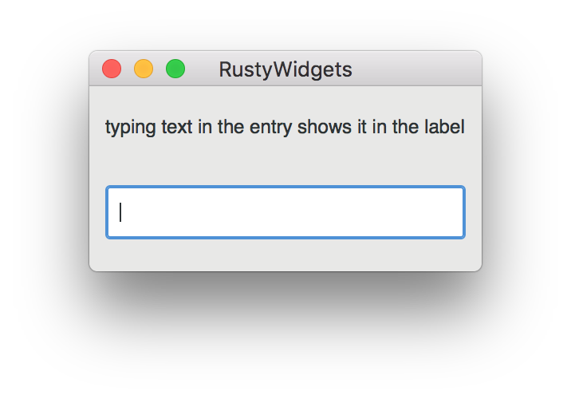

# RustyWidgets

An example program see how easy it is to make usable macOS GUI apps with rust
and GTK+.

To install dependencies, install Homebrew, then: `brew install gtk+3`

To run: `cargo run`

## Mac App Bundle Packaging

In order to make a Mac app bundle, you need to install `cargo-bundle` by running
`cargo install cargo-bundle`.

To create a package, run `./install/build_app_bundle.sh`.

