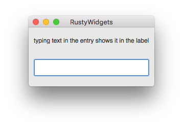

# RustyWidgets

RustyWidgets is an example program see how easy it is to make usable
cross-platform GUI apps with rust and GTK+.

To install dependencies:

```sh
brew install gtk+3
cargo install cargo-bundle
```

To run: `cargo run`

## Mac packaging

To create a package, run `./install/build_app_bundle.py`. This script uses
`cargo-bundle` to create a Mac app bundle, and then finds all of dynamically
linked libraries that the binary depends on, copies them into the app bundle,
and modifies the binary and all .dylib files to make it all work.



## Windows packaging

Haven't tried yet.

## Linux packaging

This is already a solved problem in gnu-linux-land. See [Debian Rust Packaging
Policy](https://wiki.debian.org/Teams/RustPackaging/Policy) and [Fedora's
PackagingDrafts/Rust](https://fedoraproject.org/wiki/PackagingDrafts/Rust).
